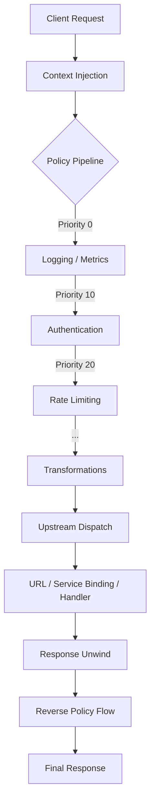

import { Aside } from '@astrojs/starlight/components';

`@homegrower-club/stoma` compiles a declarative TypeScript configuration object into a Hono app with priority-ordered policy middleware chains and upstream dispatching. This page describes the core abstractions, the request lifecycle, and the module boundaries that keep the system extensible.

## Core Concepts

Five abstractions compose every stoma gateway:

**Gateway** -- The top-level container, defined entirely in code. A `GatewayConfig` object is the single source of truth for your API surface, meaning your gateway configuration can be versioned, reviewed, and rolled back just like your application code. It declares a name, an optional `basePath`, global policies, route definitions, error handling, debug settings, and an optional admin introspection API. `createGateway(config)` validates the config and returns a `GatewayInstance` whose `.app` property is a standard Hono app ready to serve on any runtime.

**Route** -- A `RouteConfig` maps a path pattern (Hono syntax, e.g. `/users/:id`) plus optional HTTP method constraints to a pipeline. Routes are registered on the Hono app via `app.on(methods, path, ...handlers)`.

**Pipeline** -- A `PipelineConfig` pairs an ordered list of policies with an upstream target. The pipeline is the execution unit for a single route: policies run in priority order, and the final handler dispatches to the upstream.

**Policy** -- A named Hono middleware with a numeric priority. Policies are the building blocks of pipelines. They can inspect, transform, short-circuit, or augment requests and responses. Stoma ships 39 built-in policies across 6 categories, plus a Policy SDK for custom policy development. See the [Policy System](/concepts/policies/) page for details.

**Upstream** -- The terminal destination for a request. Stoma supports three upstream types: URL proxy, Cloudflare Service Binding, and inline handler. See the [Upstream Types](/concepts/upstreams/) page for details.

## The Request Lifecycle

Stoma transforms an incoming request through a series of well-defined stages, ensuring observability and security at every step.



### Step-by-step Execution Flow

1. **Request ingress.** A client HTTP request arrives at the Cloudflare Worker. Hono's router matches it against registered routes (including the gateway's `basePath` prefix).

2. **Request ID generation.** The context injector middleware runs first on every matched route. It generates a unique request ID via `crypto.randomUUID()` and records the start timestamp.

3. **Trace context propagation.** If the incoming request carries a W3C `traceparent` header, the trace ID is extracted and reused. Otherwise a new trace context is generated. A fresh span ID is created for this gateway hop.

4. **Route matching.** Hono's built-in router resolves the incoming path against routes registered with `app.on(methods, fullPath, ...handlers)`. The `fullPath` is the concatenation of `GatewayConfig.basePath` and `RouteConfig.path`. If no route matches, a structured JSON 404 is returned.

5. **Policy pipeline execution.** Global policies (from `GatewayConfig.policies`) and route-level policies (from `PipelineConfig.policies`) are merged by name -- route-level wins on collision -- and sorted by priority ascending (lower numbers run first). Each policy executes as Hono middleware. Per-policy execution duration is automatically recorded and accumulated on the context under the `_policyTimings` key.

6. **Skip evaluation.** Every policy config supports an optional `skip` function. When `skip` returns `true`, the policy calls `next()` without executing its logic. This enables conditional bypass based on request properties (path, method, headers, etc.).

7. **Short-circuit.** Any policy can terminate the pipeline early by returning a `Response` without calling `next()`. Authentication failures, rate limit violations, and IP blocks all use this mechanism. The response unwinds through any earlier policies that already called `next()`.

8. **Upstream dispatch.** If no policy short-circuits, the terminal handler dispatches the request to the configured upstream. For URL upstreams, this is a `fetch()` call with SSRF protection. For Service Binding upstreams, it calls `binding.fetch()`. For handler upstreams, it invokes the inline function directly.

9. **Response unwind.** After the upstream returns (or a policy short-circuits), Hono's middleware stack unwinds in reverse order. Policies that called `next()` earlier can now modify the response -- for example, `requestLog` captures the status code and duration, and `rateLimit` sets `X-RateLimit-*` headers.

10. **Response egress.** The context injector adds the `x-request-id` header (configurable via `requestIdHeader`) and the W3C `traceparent` header to the final response. The response is returned to the client.

## Module Boundaries

```
src/
+-- core/                Gateway lifecycle
|   +-- gateway.ts       createGateway() -- the main entry point
|   +-- pipeline.ts      buildPolicyChain(), policiesToMiddleware(), createContextInjector()
|   +-- types.ts         GatewayConfig, RouteConfig, PipelineConfig, UpstreamConfig,
|   |                    AdminConfig, GatewayInstance, GatewayRegistry
|   +-- errors.ts        GatewayError class, error response builders
|   +-- health.ts        health() route factory with upstream probing
|
+-- policies/            Self-contained policy implementations (33 policies)
|   +-- types.ts         Policy, PolicyConfig, PolicyContext interfaces
|   +-- index.ts         Barrel export for all policies, SDK, and types
|   +-- proxy.ts         Header manipulation + timeout wrapping (priority 95)
|   +-- mock.ts          Static mock responses for dev/testing (priority 999)
|   +-- auth/            jwt-auth, api-key-auth, basic-auth, oauth2, rbac
|   +-- traffic/         rate-limit, ip-filter, geo-ip-filter, cache, ssl-enforce,
|   |                    request-limit, json-threat-protection, regex-threat-protection,
|   |                    traffic-shadow, interrupt, dynamic-routing, http-callout
|   +-- resilience/      timeout, retry, circuit-breaker, latency-injection
|   +-- transform/       cors, override-method, assign-attributes, assign-content,
|   |                    request-transform, response-transform, request-validation
|   +-- observability/   request-log, metrics-reporter, assign-metrics
|   +-- sdk/             Policy authoring toolkit
|       +-- priority.ts  Named priority constants (Priority.AUTH, Priority.EARLY, etc.)
|       +-- helpers.ts   resolveConfig(), policyDebug(), withSkip()
|       +-- define-policy.ts  definePolicy() convenience wrapper
|       +-- testing.ts   createPolicyTestHarness() for policy unit tests
|
+-- observability/       Admin and metrics infrastructure
|   +-- admin.ts         registerAdminRoutes() — ___gateway/* introspection endpoints
|   +-- metrics.ts       MetricsCollector interface, Prometheus text formatter
|
+-- config/              Type re-exports (future: validation, dynamic config loading)
|   +-- schema.ts        Config schema validation
|
+-- adapters/            Storage backend implementations
|   +-- cloudflare.ts    Cloudflare KV adapter (placeholder)
|   +-- durable-object.ts  Durable Object rate limit store
|   +-- memory.ts        In-memory stores for development
|   +-- types.ts         Store interfaces
|
+-- utils/               Pure utilities
    +-- request-id.ts    generateRequestId() using crypto.randomUUID()
    +-- cidr.ts          CIDR range parsing and IP matching
    +-- ip.ts            Client IP extraction from headers
    +-- debug.ts         Debug logger factory and noop logger
    +-- trace-context.ts W3C Trace Context parsing, generation, formatting
    +-- redact.ts        Secret redaction for config output
```

### Dependency rules

The `core/` module **never imports specific policy implementations**. It depends only on the `Policy` interface from `policies/types.ts`. This means you can add, remove, or modify any policy without touching the gateway core.

Each policy file is self-contained with no cross-policy dependencies. A policy imports only from:

- `core/errors.ts` -- to throw `GatewayError` for structured error responses
- `core/pipeline.ts` -- to read `PolicyContext` via `getGatewayContext(c)`
- `policies/types.ts` -- for the `Policy` and `PolicyConfig` interfaces
- `policies/sdk/` -- for `definePolicy()`, `Priority` constants, and helpers
- `utils/*` -- for shared pure utilities (IP extraction, CIDR parsing, etc.)

This isolation ensures that policy implementations can be tree-shaken independently and tested in isolation without bootstrapping the full gateway.

### Policy SDK

The `policies/sdk/` module provides a layered authoring toolkit for both built-in and custom policies:

- **Layer 1 -- Priority constants.** Named constants (`Priority.AUTH`, `Priority.EARLY`, `Priority.RATE_LIMIT`, etc.) replace magic numbers.
- **Layer 2 -- Composable helpers.** `resolveConfig()` merges defaults with user config. `policyDebug()` creates a pre-namespaced debug logger. `withSkip()` wraps a handler with `PolicyConfig.skip` logic.
- **Layer 3 -- `definePolicy()`.** A full convenience wrapper that combines all Layer 2 helpers into a single declarative API. Takes a `PolicyDefinition` and returns a factory function.
- **Layer 4 -- `createPolicyTestHarness()`.** Creates a minimal Hono app with context injection, error handling, and a configurable upstream for unit testing a policy in isolation.

### Admin Introspection API

When `GatewayConfig.admin` is enabled, the gateway registers `___gateway/*` routes for operational visibility:

- `GET /___gateway/routes` -- lists all registered routes with methods, policies, and upstream type
- `GET /___gateway/policies` -- lists all unique policies with their priorities
- `GET /___gateway/config` -- serialized config with secrets redacted
- `GET /___gateway/metrics` -- Prometheus text format metrics (requires a `MetricsCollector`)
- `GET /___gateway/health` -- basic health status with route and policy counts

Admin routes support optional authentication via `AdminConfig.auth`.

<Aside type="note">
The `health()` function is unique among the built-in policies. It returns a `RouteConfig` (not a `Policy`) and is added directly to the `routes` array rather than to a pipeline's policy list. It supports optional upstream probing for liveness checks.
</Aside>
